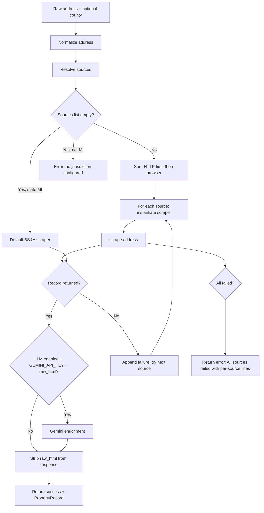

# Current process: property scrape pipeline

This document describes **what runs, in what order**, when you call the scrape pipeline (`POST /api/v1/scrape`, `run_pipeline()`, or `backend/run_demo.py`). It reflects the **US-only** flow and the scrapers registered today.

---

## End-to-end flow

---

## Step 1 — Address normalization

- **Input:** `raw_address` string, optional `county` hint.
- **Code:** `core.address.normalizer.normalize_address`
- **Output:** `NormalizedAddress` (US parsing via `usaddress`, ZIP→county hints where configured), including `pipeline_id` (for example `us_mi_calhoun` when state/county match a registry entry).

---

## Step 2 — Resolve data sources

- **Code:** `core.discovery.source_resolver.resolve_ordered_sources`
- **Order of resolution:**
  1. If `USE_SITE_DATABASE` is enabled and Postgres is available, load sources from the **site registry** (`site_repository.fetch_sources_for_address`).
  2. If there are no DB rows, or `MERGE_YAML_REGISTRY` is true, or DB rows do not map to any **implemented** scraper, merge sources from **YAML** under `backend/registry/` (`JurisdictionRegistry.lookup` by country/state/county).
- **Sorting (before running scrapers):** Sources are sorted so **`requires_browser: false` (HTTP/API) runs before Playwright**, then by preference for sources that advertise `tax` in `data_types`. This reduces hitting bot walls before cheaper HTTP attempts.

---

## Step 3 — Run scrapers until one succeeds

- **Code:** `core.orchestration.pipeline.run_pipeline`
- **Registry:** Each source names a `scraper` slug; only slugs in `SCRAPER_MAP` are executed. Unknown slugs are **skipped** and recorded as failures (“not implemented in SCRAPER_MAP”).
- **Loop:** For each source in order: build the scraper (`headless`, `source_params`, optional `uid`), call `await scraper.scrape(address)`, then `await scraper.close()`.
- **Stop:** First non-`None` `PropertyRecord` stops the loop.

### Michigan default (no YAML/DB match)

- If **no sources** were resolved **and** `address.state == "MI"`, the pipeline runs **`BSAOnlineScraper`** once with default settings (Bedford-style uid in code) as a last resort.

### Implemented scrapers today (`SCRAPER_MAP`)

| Slug | Role |
|------|------|
| `us_cook_assessor_parcel_addresses` | **Cook County IL / Chicago:** Socrata parcel + assessed values (see above), then optional **Playwright** visit to the Treasurer “Your Property Tax Overview” PIN page to fill `tax_history[].total_tax`, `total_paid`, `total_due`, `last_paid` when the HTML matches our parsers. Disable with `treasurer_tax_enrich: false` in YAML; requires `python3 -m playwright install chromium`. |
| `us_arcgis_parcel_query` | HTTP GET to an ArcGIS `MapServer/.../query` — set `params.preset` (`battle_creek`, `harris_hcad`, `maricopa_az`, `cook_il`) and `params.layer_url`. Examples: Calhoun MI Battle Creek layer; [HCAD Harris TX](https://www.gis.hctx.net/arcgis/rest/services/HCAD/Parcels/MapServer/0); [Maricopa AZ](https://gis.mcassessor.maricopa.gov/arcgis/rest/services/Parcels/MapServer/0). |
| `us_regrid_parcel` | [Regrid](https://regrid.com/api) Parcel API v2 (`REGRID_API_TOKEN` in env). Optional `regrid_path` in YAML narrows the search (e.g. `/us/tx/harris`). |
| `us_michigan_bsa_online` | Playwright against **BS&A Online** (`uid` from registry). |

Registry examples: `registry/us/illinois/cook.yaml`, `registry/us/michigan/calhoun.yaml`, `registry/us/texas/harris.yaml`, `registry/us/arizona/maricopa.yaml`.

---

## Step 4 — Optional LLM enrichment

- Runs only if: `use_llm` is true **and** `GEMINI_API_KEY` is set **and** the record still has `raw_html`.
- **Code:** `core.extraction.llm_extractor` (merge into `PropertyRecord`, bump confidence).
- **API response:** `raw_html` is cleared before returning to the client.

---

## Step 5 — Failure handling

- If every source fails or returns no record, the API returns an **error string** that lists **each source line-by-line**, for example:
  - `scraper '…' is not implemented in SCRAPER_MAP`
  - `SourceName: ExceptionType: message` (including BS&A **security verification** when raised)
  - `SourceName: no matching parcel data returned`
- If there are **no sources** for a **non-Michigan** state, the error explains that **no jurisdiction** is configured in the registry.

---

## How to run this process locally

| Entry point | What it does |
|-------------|----------------|
| `POST /api/v1/scrape` | FastAPI route → `run_pipeline` → JSON response. |
| `python backend/run_demo.py` | Demo address + normalization printout + full pipeline. |
| `python backend/fetch_calhoun_portal_data.py` | Direct ArcGIS-only fetch for the Calhoun layer (same scraper as registry). |

---

## Configuration touchpoints (not exhaustive)

- **Registry YAML:** `backend/registry/us/michigan/calhoun.yaml` (example jurisdiction).
- **Environment:** `.env` / `.env.example` — e.g. `GEMINI_API_KEY`, `USE_SITE_DATABASE`, `DATABASE_URL`, `MERGE_YAML_REGISTRY`.
- **Deeper architecture:** see `ARCHITECTURE.md` in this repo.

---

## Maintenance note

When you add a new portal, you typically: add a scraper class, register it in `SCRAPER_MAP`, and add or extend a YAML (or DB row) under the correct `pipeline_id` / jurisdiction key. Update this file if the **high-level steps** or **default behaviors** change.
