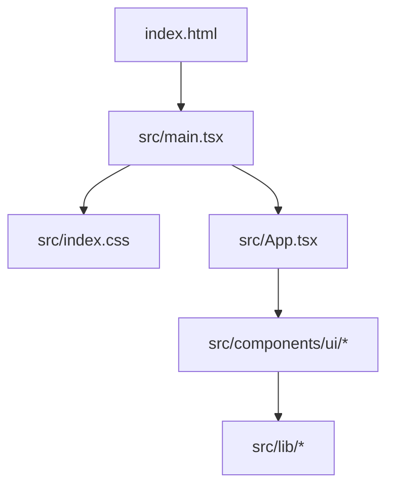

# Frontend architecture

This document describes how the `frontend` application is structured, which tools it uses, and how pieces fit together. It reflects the current codebase so it can evolve as features are added.

## Purpose

Single-page React application served and bundled by Vite. The UI is built with Tailwind CSS v4, shadcn-style primitives (Radix Nova pattern), and TypeScript throughout.

## High-level diagram



## Tech stack

| Layer | Choice |
| --- | --- |
| Runtime | React 19 |
| Language | TypeScript (project references: `tsconfig.app.json`, `tsconfig.node.json`) |
| Bundler / dev server | Vite 8 |
| Styling | Tailwind CSS 4 via `@tailwindcss/vite` |
| Component primitives | shadcn CLI config + `radix-ui`, `class-variance-authority`, `tailwind-merge`, `clsx` |
| Icons | `lucide-react` (per `components.json`) |
| Fonts | `@fontsource-variable/geist` |
| Lint | ESLint 9 flat config (`eslint.config.js`) with `typescript-eslint`, React Hooks, React Refresh |

## Directory layout

```
frontend/
├── index.html              # HTML shell; mounts #root, loads /src/main.tsx
├── vite.config.ts          # Vite + React plugin + Tailwind plugin; @ alias → ./src
├── package.json
├── components.json         # shadcn/ui generator settings (aliases, CSS entry, style preset)
├── tsconfig*.json          # TS paths: @/* → src/*
├── eslint.config.js
├── public/                 # Static assets (favicon, icons)
└── src/
    ├── main.tsx            # createRoot, StrictMode, global CSS import
    ├── App.tsx             # Root component (currently minimal)
    ├── App.css             # App-scoped styles (minimal)
    ├── index.css           # Tailwind entry, shadcn theme CSS, design tokens, Geist font
    ├── assets/             # Images and static media imported by components
    ├── components/
    │   └── ui/             # Generated / hand-maintained UI primitives (e.g. button)
    └── lib/
        └── utils.ts        # `cn()` helper (clsx + tailwind-merge)
```

Planned-by-config paths (not all exist yet): `@/hooks` for shared hooks—add `src/hooks/` when needed.

## Application bootstrap

1. **`index.html`** defines `<div id="root">` and loads `src/main.tsx` as an ES module.
2. **`main.tsx`** imports global styles from `index.css`, renders `<App />` inside `StrictMode` via `createRoot`.

There is no client-side router or data layer in the tree yet; the app is a thin shell ready for routes, API clients, or state libraries to be introduced deliberately.

## Build and scripts

| Script | Behavior |
| --- | --- |
| `npm run dev` | Vite dev server with HMR |
| `npm run build` | `tsc -b` then `vite build` → output in `dist/` |
| `npm run preview` | Serves production build locally |
| `npm run lint` | ESLint over the project |

## Module resolution

- **Vite** (`vite.config.ts`): `resolve.alias` maps `@` to `./src`.
- **TypeScript** (`tsconfig.json` / `tsconfig.app.json`): `paths` maps `@/*` to `./src/*`.

Imports should use the `@/` prefix for anything under `src/` (for example `@/lib/utils`, `@/components/ui/button`).

## UI and design system

- **Generator**: `components.json` targets the **radix-nova** style, TSX, no RSC, **neutral** base color, CSS variables, and points Tailwind at `src/index.css`.
- **Primitives**: Components live under `src/components/ui/`. They compose Radix patterns, CVA for variants, and the shared `cn()` utility for class merging.
- **Theme**: `index.css` imports Tailwind, animation helpers (`tw-animate-css`), `shadcn/tailwind.css`, and defines `:root` / `.dark` CSS variables (OKLCH-based palette) alongside custom marketing-style tokens where applicable.
- **Dark mode**: `@custom-variant dark (&:is(.dark *));`—toggle dark theme by placing `.dark` on an ancestor (typically `html` or `body`).

## Conventions for extending the app

1. **New pages or features**: Prefer colocating feature components under `src/components/` or introduce `src/features/<name>/` if the app grows; keep `ui/` for reusable, design-system-level pieces.
2. **New shadcn components**: Use the shadcn CLI with this repo’s `components.json` so files land under `src/components/ui/` and match existing aliases.
3. **Global styles**: Prefer Tailwind utilities and theme variables in `index.css`; reserve `App.css` for rare app-wide overrides if needed.
4. **Types**: Keep `src/` under `tsconfig.app.json`; use `tsconfig.node.json` for Vite/config-only files.

## Related files (quick reference)

- Bundler and alias: `vite.config.ts`
- Path aliases and TS strictness: `tsconfig.app.json`
- Design tokens and Tailwind: `src/index.css`
- shadcn options: `components.json`

When this architecture changes (for example adding React Router, TanStack Query, or an API client), update this file in the same pull request so newcomers stay oriented.
